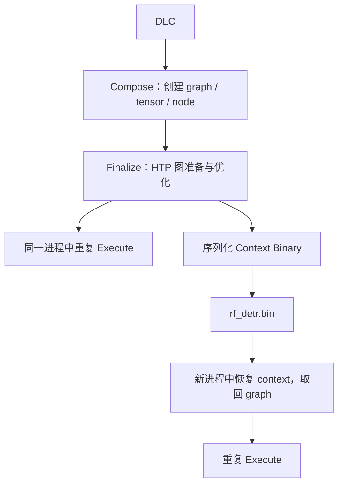

# 从一份 DLC 到手机上的 C++ 推理程序

这个工程围绕一个问题展开：我拿到 RF-DETR 的 DLC 后，谁把它变成 HTP 能执行的图，谁准备输入，谁发起执行，哪些工作可以提前完成？

建议第一次按本页跑命令，第二次对照 [C++ 导读](../cpp/README.md) 看源码，第三次关掉说明自己重放 `command.txt`。当前实验的实际结果见 [验证报告](../report/lifecycle-results.md)。

## 1. 先分清模型资产、执行程序和硬件

| 对象 | 在这个项目里的职责 |
| --- | --- |
| `RF_DETR_DLC` 指向的 `.dlc` | 保存模型图、权重和相关信息；不是 Linux/Android executable |
| `libQnnModelDlc.so` | 读取 DLC，并把模型组织成 QNN backend 中的图；不是 RF-DETR 专属的生成模型库 |
| `libQnnHtp.so` | CPU 侧 HTP backend，提供 QNN API，管理面向 HTP 的模型准备和运行 |
| `libQnnHtpPrepare.so` | HTP 图准备所需的库；当前 DLC 现场 prepare 路径会部署它 |
| V79 `Stub` / `Skel` | CPU/DSP 两侧配套组件，参与跨处理器调用；Skel 来自 SDK 的 Hexagon V79 目录 |
| `libQnnSystem.so` | 本项目 C++ 用它读取 context 中的 graph/tensor metadata |
| `qnn-net-run` | Qualcomm 已写好的命令行 runtime；它读取文件、调用 QNN、输出结果和 profiling |
| `qnn-context-binary-generator` | 预先创建并 finalize 图，再把 context 序列化到文件 |
| `rf_detr.bin` | 预生成的 context binary；可包含图的已准备状态，仍需要 runtime 和兼容硬件 |
| `qnn-context-runner` | 我们的 Android aarch64 C++ 程序；读 binary、准备 tensor、调用 execute |

CPU 在这个过程中并没有消失。文件读取、应用代码、QNN API 调用和部分准备工作发生在 CPU 侧，模型图交给 HTP backend 执行。不能把整条进程运行时间都说成“NPU 推理时间”。

`LD_LIBRARY_PATH` 用来寻找 CPU 侧动态库；`ADSP_LIBRARY_PATH` 为 DSP 侧库查找提供路径。脚本将二者设为设备 runtime 目录。两种架构的库不能互换，也不能把 host x86_64 的 `.so` 放到 Android ARM64 上用。

## 2. 三条路径的区别只有模型准备的位置与 runtime 的作者



Compose 是一段流程：创建 graph，登记张量，添加节点与连接。不要寻找一个通用的 `QnnGraph_compose()` API；模型加载器会组织这些调用。

`QnnGraph_finalize()` 是明确的 QNN API 边界。对本项目的 HTP 图，它触发重要的准备与优化工作，成功后图可用于执行。Finalize 的具体内部步骤由 backend 实现，不是我们逐算子写的 C++。

Context binary 是在已准备 context 上调用序列化接口保存的资产。可将 DLC 类比为 TensorRT build 前的模型资产，将 context binary 类比为序列化 engine。但二者格式和能力并不完全对应：QNN context 可以含多个 graph，跨 SDK、SoC、HTP 架构的兼容性也有约束。

“离线 prepare”在这里表示从每次推理启动流程中移走准备步骤，不要求一定在 PC 上生成。本阶段在 S25 Ultra 上预生成；host offline prepare 是后续单独实验，尚未验证。

## 3. 从头运行本项目

以下命令均在仓库根目录运行。SDK、模型、NDK 和 Python 包需要用户事先提供，命令不会下载它们。已有配置不要再次复制覆盖。

本机配置在 `config/local.env`，可参考 [配置示例](../config/s25u.env.example)：

```bash
QAIRT_ROOT="/绝对路径/QAIRT/2.45.0.260326"
RF_DETR_DLC="/绝对路径/rf_detr.dlc"
RF_DETR_INPUT_IMAGE="/绝对路径/001.jpeg"
ANDROID_NDK_ROOT="/绝对路径/android-ndk"
ANDROID_API=28
DEVICE_SERIAL=""  # 一台在线设备时自动选择；多台时指定
```

所有示例路径都要换成自己的真实路径。`local.env` 是受信任的 Bash 文件，其赋值优先于同名环境变量。本项目设备根目录固定为 `/data/local/tmp/qnn_mobile`。

```bash
source .venv/bin/activate       # 项目要求 Python 3.11
make doctor                    # 检查 Python、SDK、DLC、adb，已配置时也检查 NDK
make inspect-device            # 确认连接的确实是目标手机
make prepare                   # JPEG → RGB resize → NCHW float32 → image.raw
make deploy-runtime            # 部署 ARM64 程序/库与 Hexagon V79 Skel
make deploy                    # 部署 DLC、raw 和设备 input_list，并核对哈希

make lifecycle-dlc             # 第一段：DLC 现场 Compose/Finalize，再执行 6 次
make context-build             # 第二段 build：同一 DLC → 手机上的 rf_detr.bin
make context-run               # 第二段 run：恢复该 binary，再执行 6 次
make cpp-build                 # 第三段 build：NDK 编译自己的 executable
make cpp-run                   # 第三段 run：自己的 executable 恢复 binary、执行 6 次
make lifecycle-compare         # 三条路径每次输出对比，汇总时间
make cpp-check                 # 错误张量名、错误字节数、损坏 context 的失败检查
.venv/bin/python -m unittest discover -s tests -v  # 在临时副本中检查验收程序会拒绝错误结果
```

工具阶段不依赖 NDK；`cpp-build` 才需要交叉编译器。Python 依赖包括 NumPy、Pillow、PyYAML；若缺失应手动准备。准备、比较使用 `.venv/bin/python`，`doctor` 检查当前激活的 Python，所以仍应先激活 venv。

重复次数可改成 `NUM_INFERENCES=10 make cpp-run`，对另外两个执行入口也有效。`context-build` 不做推理，没有输入样本执行次数。重复执行时每轮都使用同一张图，保存每次输出，不代表处理了 6 张不同图片。

命令是有依赖的；学习时按顺序执行，不使用 `make -j` 同时操作手机。切换 DLC/runtime 后重新 deploy、context-build、context-run、cpp-run；切换输入后重新 prepare、deploy，再跑三条执行路径。

旧 `make run → make pull → make decode` 仍用于原来的单图检测展示，保留默认 float 输出。新生命周期结果是 native 输出，不能直接交给旧单次解码脚本。

## 4. 看懂 shell 实际在执行什么

主体在 [scripts/lifecycle.sh](../scripts/lifecycle.sh) 的 `case "$mode"` 中。外面的代码负责独立目录、部署内容验证、日志保存与拉取；真正决定路线的是以下参数组合。

这些简化命令要在 **adb shell 的设备 shell 内**运行。先令 `R` 指向设备 runtime 目录，`B` 指向已部署的项目根目录，并为每次运行选择新的输出目录；完整可重放命令由脚本保存在 `command.txt`。

```bash
R=/data/local/tmp/qnn_mobile/runtime
B=/data/local/tmp/qnn_mobile
export LD_LIBRARY_PATH="$R"
export ADSP_LIBRARY_PATH="$R"
```

第一段的关键调用是：

```bash
"$R/qnn-net-run" \
  --backend "$R/libQnnHtp.so" \
  --model "$R/libQnnModelDlc.so" \
  --dlc_path "$B/models/rf_detr/model.dlc" \
  --input_list "$B/input/rf_detr/input_list.txt" \
  --output_dir "$B/lifecycle/manual-dlc" \
  --use_native_input_files --use_native_output_files \
  --num_inferences 6 --keep_num_outputs 6 \
  --profiling_level basic --log_level verbose
```

这里 `--model` 指向 DLC 加载器库，`--dlc_path` 才是模型数据。一次进程启动只需先建图/Finalize，之后循环 execute；不是每一张输入都重新 prepare。

第二段分两次进程调用：

```bash
"$R/qnn-context-binary-generator" \
  --backend "$R/libQnnHtp.so" \
  --model "$R/libQnnModelDlc.so" \
  --dlc_path "$B/models/rf_detr/model.dlc" \
  --binary_file rf_detr --output_dir "$B/lifecycle/manual-build" \
  --profiling_level basic --log_level verbose

"$R/qnn-net-run" \
  --backend "$R/libQnnHtp.so" \
  --retrieve_context "$B/lifecycle/manual-build/rf_detr.bin" \
  --input_list "$B/input/rf_detr/input_list.txt" \
  --output_dir "$B/lifecycle/manual-context" \
  --use_native_input_files --use_native_output_files \
  --num_inferences 6 --keep_num_outputs 6 \
  --profiling_level basic --log_level verbose
```

恢复时不再传 `--model` 或 `--dlc_path`。在这个已验证的固定 HTP 路径中，执行端不需要再次从 DLC 建图。我们的实验包装脚本仍核对原 DLC 哈希，是为了记录来源；这不是 C++ runner 的运行依赖。

第三段改用自己的 executable，其实际参数同样在 `cpp.*/command.txt` 中。它只读 `--context` 和具名 `--input`，不会暗中再启动 `qnn-net-run`，也不链接 RF-DETR 的 Python 代码。

## 5. 输入输出为什么必须自己负责

`image.raw` 只有数据，没有 JPEG 编码、shape 或 dtype 头信息。输入列表只把名字关联到文件：

```text
image:=/data/local/tmp/qnn_mobile/input/rf_detr/image.raw
```

这份 RF-DETR 输入是 `[1,3,512,512]`、RGB、NCHW、float32，字节数 `1×3×512×512×4 = 3,145,728`。预处理使用 bilinear resize 和 `/255`；mean/std 在当前模型内部，外部不重复做。

输出的 contract 为：

| tensor | 逻辑类型 | shape | 文件字节数 | 新 net-run 文件名 | C++ 文件名 |
| --- | --- | --- | --- | --- | --- |
| boxes | float32 | [1,300,4] | 4,800 | boxes.raw | boxes.raw |
| logits | float32 | [1,300] | 1,200 | logits.raw | logits.raw |
| classes | int32 | [1,300] | 1,200 | classes_native.raw | classes.raw |

相同字节数不保证相同类型。用 float32 解读 int32 的类别 ID 会得到错误数字。旧 net-run 默认把 classes 写成 float；本阶段明确开启 native，比较程序按 int32 读取。

名字叫 `logits` 也不意味着要再 sigmoid；根据这份模型 recipe，它已是分数。boxes 是 512 坐标系中的 xyxy。runtime 只负责准确执行图，画框、阈值与类别名称属于 RF-DETR 的模型后处理。

## 6. 在哪里看到每一步耗时

每次实验保存在 `output/lifecycle/<阶段>.<随机后缀>/`，设备上有同名目录：

| 文件 | 读它是为了回答什么 |
| --- | --- |
| command.txt | 这次到底调用了哪个程序，传了什么参数？ |
| environment.txt / sha256.txt | 哪个设备、SDK、模型、输入和 binary？传输内容相同吗？ |
| run.log / exit-code.txt | 发生了什么，整个进程最终是否退出成功？ |
| profile.txt / profile.csv | Qualcomm 工具记录的建图、Finalize、恢复及各次 Execute 多久？ |
| qnn-profiling-data.log | 原始 profiling，可再次交给 viewer 解读 |
| execution_metadata.yaml | net-run 看到的图名、类型、shape 和完成次数？ |
| tensors.tsv / timings.csv | C++ 自己看到的 tensor contract 和每段 API wall time？ |
| Result_0 … Result_5 | 每次实际输出是否相同？ |
| context-source.txt | 这次恢复的是哪一次 build 的 binary？ |

`latest-*.txt` 指向每阶段最近一次**成功**实验；失败不更新它。`make lifecycle-compare` 会打印所使用的结果，并写 `comparison.json`。重新生成 context 后应重跑 context-run 和 cpp-run，比较程序拒绝混用不同 build。

QAIRT 的 profiling 主 log 实测是 symlink，目录拉取可能提示跳过；脚本随后显式读取目标并核对 SHA256，所以这条 adb 提示本身不表示 profiling 丢失。

注意时间的口径：

- 此次工具 `INIT` 包含其定义的初始化工作，DLC 路径中基本包含 Compose + Finalize，不能把三项重复相加。
- `Finalize / QNN time` 和 `Accelerator finalize time` 是不同层级。很多准备成本在 CPU/backend 侧，不能只拿 DSP 的短时间代表整个 prepare。
- 恢复路径的 `INIT` 不能代替整个进程启动时间。C++ 将读文件、backend/device create、context restore 分开计时，能看到其他成本仍然存在。
- C++ 的 `execute_i` 是 CPU 侧同步 `graphExecute` 的 wall time，含 RPC 等成本，排除了我们放在计时区间外的文件读写；它不是纯 HTP kernel 时间。
- verbose/basic profiling 和 C++ warn/no profiling 的开销不同，手机频率、温度与后台负载未受控。此阶段学习生命周期，不据此宣称自写 C++ 提速。
- 第 0 次与后续样本分开汇总。只有 5 个后续样本，不足以证明稳态，也不保证第一次一定更慢。

## 7. 如果换成另一份 DLC，具体改哪里

先确认它的来源、目标 backend 能否支持、静态/动态 shape、input/output 名字、layout、dtype、量化参数、预处理与后处理。DLC 扩展名本身不能证明 HTP 兼容，也不能告诉你如何处理 JPEG 或点云。

按这个顺序落地：

1. 为模型写一份像 [RF-DETR 模型说明](../models/rf_detr/README.md) 的 contract；记录版本/哈希，避免只有一个“model.dlc”。
2. 写模型专用 `prepare.py`，产生与 contract 一致的 native raw 和 `input_list`。多输入按真实名字分别提供；量化模型不能直接照搬本例 float 数据。
3. 先用 DLC + `qnn-net-run` 跑通，查看真实 metadata，检查输入字节数与输出含义。Finalize 若失败，检查 backend 支持、op package、shape 和量化，不要先怀疑 C++。
4. 用相同 SDK/backend/目标环境生成 context，再用 net-run 恢复，比较结果；保存 binary 的来源信息。
5. 若符合单 graph、静态 dense float32/int32 范围，现有 C++ 可传新的 binary 和多组 `--input name=file`，无需改 RF-DETR 算法代码。其他 dtype、动态形状、多图或自定义 op package 必须先明确实现相应支持；目前程序会对不支持的 tensor 类型和形状报错。
6. 为新模型写结果校验/后处理，将原始输出对齐 net-run，再做参考框架精度验证。不要复用本项目硬编码 RF-DETR shape 的比较脚本来验证另一模型。

这里的“可复用”是代码职责可复用。当前 Makefile、部署包装脚本、prepare 与 compare 仍明确服务 RF-DETR；没有宣称 `RF_DETR_DLC` 随便替换任何模型都能自动跑。后续 UniAD 子模块也按这一流程逐个验证。

## 8. 三个小练习，确认自己能改工程

1. 将 `NUM_INFERENCES` 改成 3，说明为什么只有 3 组 Execute，而 Compose/Finalize 没有执行 3 遍；再从 CSV 找到第 0 次。
2. 在 `main()` 中定位 `contextCreateFromBinary`，解释为什么此处没有 DLC 路径，也没有 `graphFinalize`；解释 binary 文件和 QNN context handle 为什么不是同一个东西。
3. 运行 `make cpp-check`，看错误名字、错误字节数、错误 binary 在不同阶段停止。然后根据 `tensors.tsv` 手算每个 buffer 大小。

如果能解释这三件事，再沿 `main → Session → TensorBuffers` 阅读，你就能从项目代码说明“模型怎么加载、buffer 怎么组织、执行由谁发起、资源由谁释放”。

依据是本机 QAIRT 2.45 的 `include/QNN/`、`docs/QAIRT-Docs/QNN/general/tools.html` 和 SampleApp 的 API 调用关系；源码使用本机 headers 编译，未复制 SDK 实现。[Qualcomm AI Hub FAQ](https://dev.aihub.qualcomm.com/docs/hub/faq.html)和 [Qualcomm 设备端 DLC2BIN 示例](https://github.com/qualcomm/qai-appbuilder/blob/main/tools/convert/dlc2bin/README.md)可作为外部参考，具体参数以当前 SDK 帮助与本项目实测为准。
